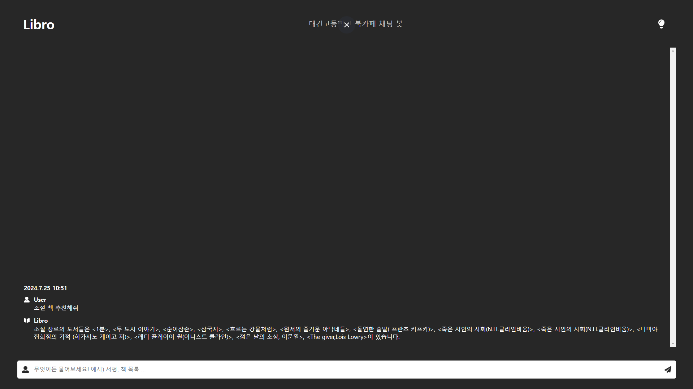

# ✨ LIBRO

대건고등학교 북카페 관리 인공지능    
 
 

 

## 01. Chatbot
### 📌 Service Sturcture

### 📌 Used Techniques

- NLP (자연어 분석) - [Mecab & Konlpy](https://pypi.org/project/python-mecab-ko/)
- NLM (N-gram Launguage Model)
- NER (개체명 인식)
- Fine Tuning (미세 조정) - [BERT](https://arxiv.org/abs/1810.04805)

### 📌 Datasets & Refrences

- [AI hub 감성 대화 말뭉치](https://aihub.or.kr/aihubdata/data/view.do?currMenu=115&topMenu=100&aihubDataSe=realm&dataSetSn=86)
- 대건고등학교 학생 도서 추천 설문 결과
- [AiChatBot - Github by II-DW](https://github.com/II-DW/AiChatBot)
- [처음 배우는 딥러닝 챗봇 (조경래 저)](http://www.yes24.com/Product/Goods/94462359)

## 02. Web Service

### 📌 Example Usage

### 📌 Front [(@lukekeum)](https://github.com/lukekeum)

- [libro - Github by lukekeum](https://github.com/lukekeum/libro)

### 📌 Back

- FastAPI
- [LIBRO - Hugging Face Model by IIDW](https://huggingface.co/IIDW/LIBRO)

